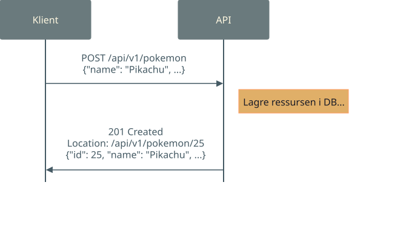

# Workshop: FastAPI
*Imre Kerr*

---

# Hva er FastAPI?

Rammeverk for å lage HTTP-APIer

Endepunkter er helt vanlige Python-funksjoner

Automatisk API-dokumentasjon og validering via type-annotasjoner

---

# ...Men hva er et HTTP-API?

Grensesnitt oppå noe kode, med et standardisert språk (HTTP)

HTTP er samme språk som nettsider bruker.



<!--
Nettside vs API: 
Nettside sender tilbake HTML som et menneske skal se på.
API sender tilbake ett eller annet som et program skal bruke
-->

---

# HTTP-verb og CRUD for SQL-folk

| | Operation | SQL | HTTP | Eksempel |
|---|---|---|---|---|
| **C** | Create | `INSERT` | PUT / POST | `PUT /pokemon/pikachu`, `POST /pokemon` |
| **R** | Read | `SELECT` | GET | `GET /pokemon/pikachu`, `GET /pokemon` |
| **U** | Update | `UPDATE` | PUT | `PUT /pokemon/pikachu` |
| **D** | Delete | `DELETE` | DELETE | `DELETE /pokemon/pikachu` |

<!--

Legg merke til at PUT er både INSERT og UPDATE.

Finnes andre verb som PATCH, QUERY, OPTIONS... 

-->

---

# Hvorfor et rammeverk?

Håndterer lavnivå detaljer så du slipper

Trenger ikke tenke på:

- TCP-forbindelser
- Parsing av requests
- Ruting til riktig funksjon
- Serialisering og deserialisering av JSON
- ...

---

# Oppgave 1: Hello, FastAPI

Åpne https://github.com/imre-kerr-sb1/fastapi-workshop i et Coder-workspace.

Skriv det her i `main.py`:


```python title="main.py"
from fastapi import FastAPI

app = FastAPI()

@app.get("/")
async def hello():
    return {"message": "Hello World"}
```
